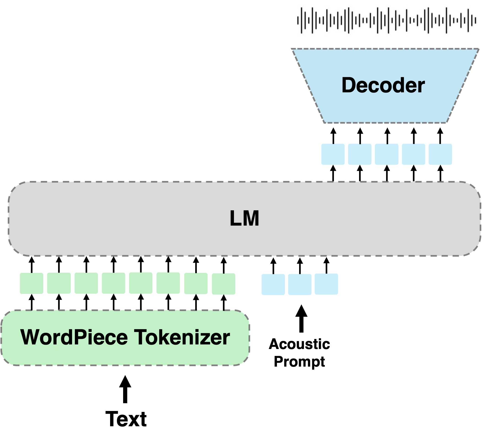

# Beyond RoboShaul: zero-shot speech synthesis in Hebrew

Recreation of "A Language Modeling Approach to Diacritic-Free Hebrew TTS" (Interspeech
2024).

<p align="center">
<a href='https://arxiv.org/abs/2407.12206'></a>
   <a href='https://pages.cs.huji.ac.il/adiyoss-lab/HebTTS/'></a>
   <a href='https://colab.research.google.com/drive/1f3-6Dqbna9_hI5C9V4qTIG05dixW-r72?usp=sharing'></a>
   <a href='https://github.com/slp-rl/HebTTS'></a>

</p>



## Try it out

You can check out some audio samples generated by our model at: [Our website](https://dasvolkov9.wixsite.com/my-site-4)

You can try the original model in the [google colab](https://colab.research.google.com/drive/1f3-6Dqbna9_hI5C9V4qTIG05dixW-r72?usp=sharing) demo. (This is the original HebTTS demo, we left it here because its so cool)

## Installation

We publish our checkpoint
in [hugging face](https://huggingface.co/D4niel0s/HebTTS_implementation/tree/main).
AR model trained for 950K steps and NAR model for 200K steps on [HebDB](https://pages.cs.huji.ac.il/adiyoss-lab/HebDB/).

### Install Dependencies

```bash
pip install -r requirements.txt
```

## Training

### Prerequisites

To avoid supplying a dataset with the final project we will assume that the starting point is having .wav files with the audio data and a .csv file for metadata with the following format:

|id|path|duration|transcript|speaker|
| -| -  |-        |   -     | -     |
|0|/path/to/wav.wav| 15.0 | The transcript of the audio | speaker_id|

### Creating The Cuts manifests

We recommend changing the relevant paths in the default argument to avoid passing many arguments ***Check All Paths***.

1. Run `valle/data_pre_processing_create_cuts_manifests.py`
2. Run `valle/bin/add_audio_tokens.py`
3. Run `valle/bin/add_tokens.py`

### Training

We recommend changing the relevant paths in the default argument to avoid passing many arguments ***Check All Paths***.

* Run `valle/bin/trainer.py`

## Evaluation
To run evaluation execute `valle\bin\evaluate.py` This will run wer and cer on the samples at `sentences_for_eval.txt` on all speakers in `speakers\speakers.yaml` file. Please note that the parameters in `evaluate.py` ***DO NOT*** use relative paths and thus will require editing.

## Inference

You can play with the model with different speakers and text prompts.

run `infer.py`:

```
python infer.py  --checkpoint checkpoint.pt --output-dir ./out --text "היי מה קורה"
```

you can specify additional arguments
`--speaker` and `--top-k`.

### Multi Band Diffusion

> [!TIP]
> We allow using the new Multi Band Diffusion (MBD) vocoder for generating a better quallity audio.
Install audiocraft and set `--mbd True` flag.

### Text

you can concatenate text prompts using `|` or specify a path of a text file spereated by `\n` if writing Hebrew in
terminal is inconvenient.

```text
תגידו גנבו לכם פעם את האוטו ופשוט ידעתם שאין טעם להגיש תלונה במשטרה
היי מה קורה
בראשית היתה חללית מסוג נחתת
```

and run

```
python infer.py  --checkpoint checkpoint.pt --output-dir ./out --text example.txt
```

### Speakers

you can use the speaker defined in `speakers.yaml`, or add additional speakers.
specify wav files and transcription in same format.

```
--speaker shaul
```
